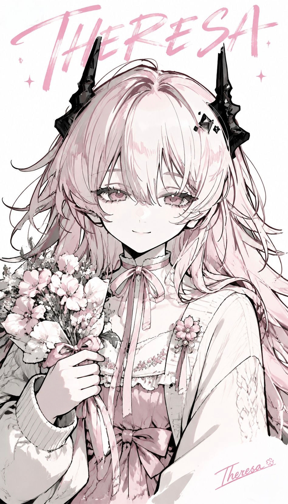
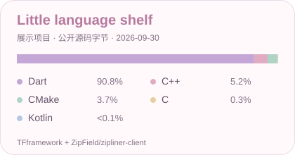
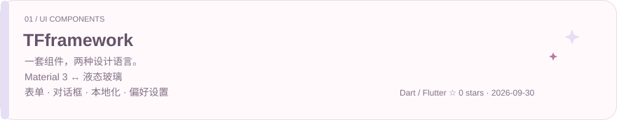
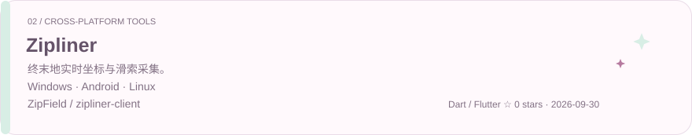
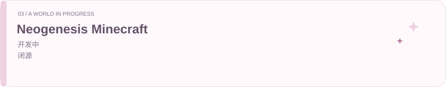

  

<h1 align="center">Hi, I'm Theresa 🌷</h1>

做一些好用的小组件、小工具，也在慢慢构建自己的 Minecraft 世界。

  
  
  
  <a href="https://github.com/Theresa-owo?tab=followers"><picture><source srcset="https://img.shields.io/github/followers/Theresa-owo?style=flat&label=Friends&labelColor=b395b4&color=e9d6e9&cacheSeconds=3600"></picture></a>

## 🍓 GitHub 小小信息板

  <picture>
    <source media="(prefers-color-scheme: dark)" srcset="https://github-stats-extended.vercel.app/api?username=Theresa-owo&show_icons=true&hide_rank=true&disable_animations=true&card_width=420&line_height=30&title_color=e4aecf&text_color=eadfeb&icon_color=cfa9d7&bg_color=24212e&border_color=4a3d51&border_radius=18">
    
  </picture>
  <picture>
    <source media="(prefers-color-scheme: dark)" srcset="assets/cute-languages-dark.svg">
    
  </picture>

统计卡与关注数由公开服务自动更新，可能有缓存；语言卡是 2026-09-30 的展示项目快照，不代表技能熟练度。[查看公开主页 ↗](https://github.com/Theresa-owo)

🍪 图片暂时没加载？这里还有公开数据快照

2026-09-30 核验：个人公开仓库 **5** 个，个人公开仓库收到 **0 Stars**，公开关注者 **3** 人，公开 PR **1** 个，公开 Issue **1** 个。

两个展示项目共查到本人 **12 次公开提交**。语言卡与提交花园只统计 TFframework、ZipField/zipliner-client；没有使用私有仓库数据。

[公开仓库](https://github.com/Theresa-owo?tab=repositories) · [公开 PR](https://github.com/search?q=author%3ATheresa-owo+is%3Apublic+type%3Apr&type=issues) · [公开 Issue](https://github.com/search?q=author%3ATheresa-owo+is%3Apublic+type%3Aissue&type=issues)

## 🌸 最近在做的小东西

<a href="https://github.com/Theresa-owo/TFframework">
  <picture>
    <source media="(prefers-color-scheme: dark) and (max-width: 600px)" srcset="assets/cute-project-tf-mobile-dark.svg">
    <source media="(max-width: 600px)" srcset="assets/cute-project-tf-mobile-light.svg">
    <source media="(prefers-color-scheme: dark)" srcset="assets/cute-project-tf-dark.svg">
    
  </picture>
</a>

[源码 ↗](https://github.com/Theresa-owo/TFframework) · <a href="https://github.com/Theresa-owo/TFframework"><picture><source srcset="https://img.shields.io/github/stars/Theresa-owo/TFframework?style=flat&color=e1cce9&labelColor=b395b4&label=Stars&cacheSeconds=3600"></picture></a>

<a href="https://github.com/ZipField/zipliner-client">
  <picture>
    <source media="(prefers-color-scheme: dark) and (max-width: 600px)" srcset="assets/cute-project-zip-mobile-dark.svg">
    <source media="(max-width: 600px)" srcset="assets/cute-project-zip-mobile-light.svg">
    <source media="(prefers-color-scheme: dark)" srcset="assets/cute-project-zip-dark.svg">
    
  </picture>
</a>

[源码 ↗](https://github.com/ZipField/zipliner-client) · [下载 ↗](https://github.com/ZipField/zipliner-client/releases/latest) · <a href="https://github.com/ZipField/zipliner-client"><picture><source srcset="https://img.shields.io/github/stars/ZipField/zipliner-client?style=flat&color=cde5da&labelColor=8fac9c&label=Stars&cacheSeconds=3600"></picture></a>

<picture>
  <source media="(prefers-color-scheme: dark) and (max-width: 600px)" srcset="assets/cute-project-neo-mobile-dark.svg">
  <source media="(max-width: 600px)" srcset="assets/cute-project-neo-mobile-light.svg">
  <source media="(prefers-color-scheme: dark)" srcset="assets/cute-project-neo-dark.svg">
  
</picture>

**Neogenesis Minecraft · 开发中 · 闭源**

## 🌱 贡献与活动小花园

<picture>
  <source media="(prefers-color-scheme: dark) and (max-width: 600px)" srcset="assets/cute-activity-mobile-dark.svg">
  <source media="(max-width: 600px)" srcset="assets/cute-activity-mobile-light.svg">
  <source media="(prefers-color-scheme: dark)" srcset="assets/cute-activity-dark.svg">
  
</picture>

花园是公开提交的日期快照，不会自动刷新。[TFframework 提交记录](https://github.com/Theresa-owo/TFframework/commits/main/?author=Theresa-owo) · [Zipliner 提交记录](https://github.com/ZipField/zipliner-client/commits/main/?author=Theresa-owo) · [GitHub 原生贡献记录](https://github.com/Theresa-owo#year-list-container)

---

谢谢你来逛逛，希望这里有你喜欢的小东西 ♡

